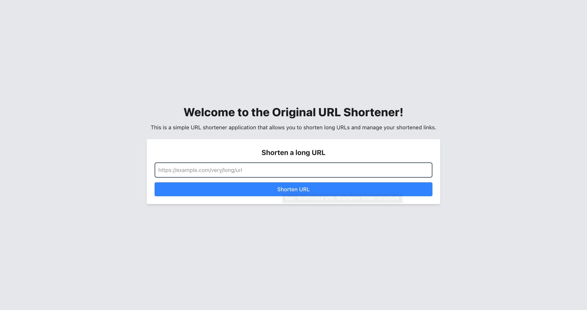
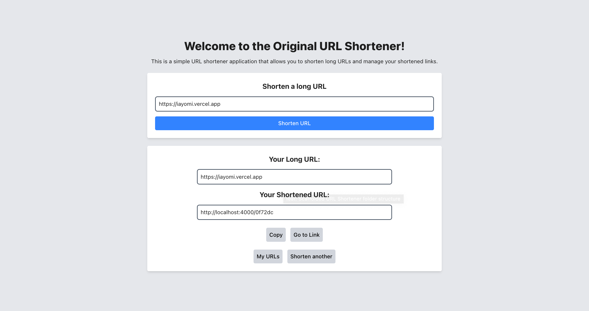
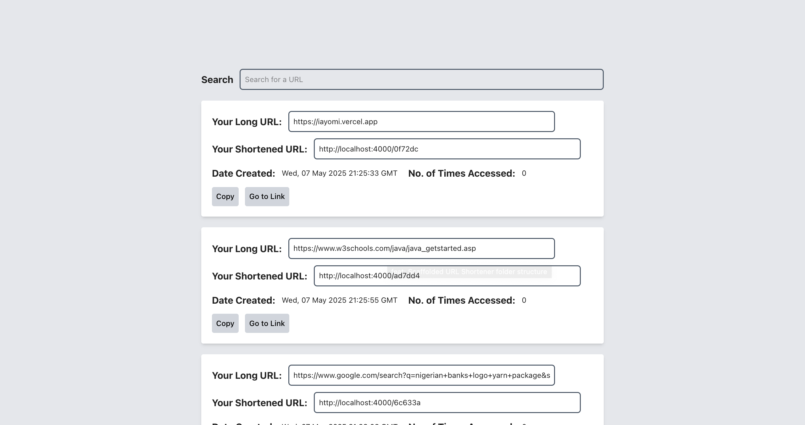

# 🔗 URL Shortener Service

Welcome to the original world of short URLs! 🚀
This is a full-stack URL Shortener application built with **React** on the frontend and **Express.js** on the backend.



You paste a long, awkward URL — we hand you back a shiny, short one.



We also keep track of how many times your shiny link was used (because we care 🩹).



---

## 💂 Project Structure

```
URL-Shortener/
├── react-client/         # Frontend (Vite + React)
│   ├── public/
│   ├── src/
│   │   ├── assets/
│   │   ├── components/
│   │   ├── pages/
│   │   ├── styles/
│   │   ├── utils/
│   │   ├── App.tsx/
│   │   ├── ...
│   ├── ...
├── node-server/          # Backend (Express + Swagger)
│   ├── src/
│   │   ├── controllers/
│   │   ├── data/
│   │   ├── resources/    # Swagger doc lives here
│   │   ├── routes/
│   │   ├── services/
│   │   ├── utils/
│   │   ├── server.js
│   ├── tests/
│   ├── ...
└── README.md
```

---

## ⚙️ Prerequisites

* Node.js (v18 or later)
* yarn
* Internet connection

---

## 🚀 Getting Started

### 1. Clone the Repository

```bash
git clone https://github.com/iAyomi/URL-Shortener.git
cd URL-Shortener 
```

---

### 2. Install Dependencies

```bash
# Install node-server dependencies
cd node-server
yarn

# Install react-client dependencies
cd ../react-client
yarn
```

---

### 3. Run the Development Servers (Client + Server)

Open two terminals (split your screen like a cool hacker 🧑‍💻)

**Terminal 1 – Start Node-Server:**

```bash
cd node-server
yarn dev
```

**Terminal 2 – Start React-Client:**

```bash
cd react-client
yarn dev
```

> By default:
>
> * React-Client runs on `http://localhost:5173`
> * Node-Server runs on `http://localhost:4000`

---

## 🥪 API Testing with Swagger

We've integrated Swagger UI because even our APIs deserve a pretty face.

### 🔍 Access the Swagger Docs

Once the Node-Server is running, go to:

```
http://localhost:4000/api-docs
```

Here, you can:

* Encode a long URL to a short one.
* Decode a short URL back to its glorious long form.
* View statistics like access count and last access time.
* Test everything *without Postman* 🧪

---

## 📦 Building for Production

Unfortunately, this is still work in progress 🥲

---

## 🥪 Running Tests (API)

We have test scripts for our encode/decode endpoints.

To run the tests:

```bash
cd node-server
yarn test
```

---

## 💡 Tips

* Use browser dev tools to inspect redirects.
* Every short URL is unique and collision-free thanks to some serious hashing and truncation.

---

## 💬 Contact

Have questions or found a bug?
[Open an issue](https://github.com/iAyomi/URL-Shortener/issues) or ping us through smoke signals (just kidding, use [Our Contact Page](https://iayomi.vercel.app/contact)).

---

Made with 🧏 precision and just a tiny bit of caffeine.
